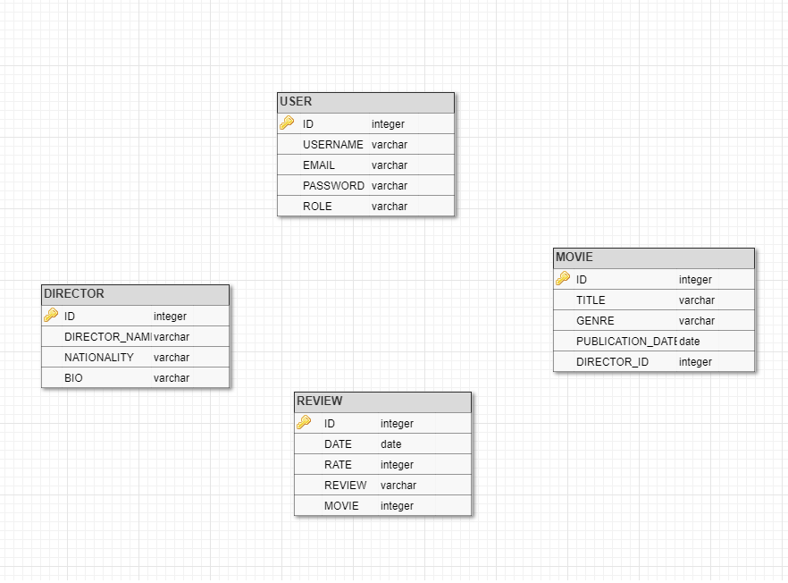

# Film katalógus

Egy REST API amely Spring Boot segítségével készül el MVC pattern alapján. Az adatokat H2 adatbázisban tároljuk a memóriában

### Célkitűzés

Film katalógus, lehet bejelentkezni, regisztrálni, adatokat lekérni, filmekre vagy rendezőkre szűrni, filmeket értékelni.
ADMIN és USER felhasználó lehet

### Fejlesztői környezet
    
NetBeans

Technológiák:  Java Spring Boot, AngularJS

### Funkcionális követelmények
 * Regisztráció
* Bejelentkezés
* Értékelés írása
* Filmek, rendezők szűrése

### Nem funkcionális követelmények
Könnyű áttekinthetőség: külön színnel jelölés (pl. User, ADMIN)

Használhatóság: Könnyű áttekinthetőség, ésszerű elrendezés, könnyed kezelhetőség

Megbízhatóság: Jelszavak védelme a háttérben. Hibásan bevitt adatok esetén a program jól láthatóan
jelezze a felhasználónak, és emelje ki a hibás beviteli mezőket. A jól bevitt adatok maradjanak az
űrlapban.

Karbantarthatóság: könnyed lehessen bővíteni, a különböző típusú fájlok külön csoportosítva,
ésszerűen legyenek felbontva, a könnyebb fejleszthetőség miatt
 ```
##Adatbázis terv


